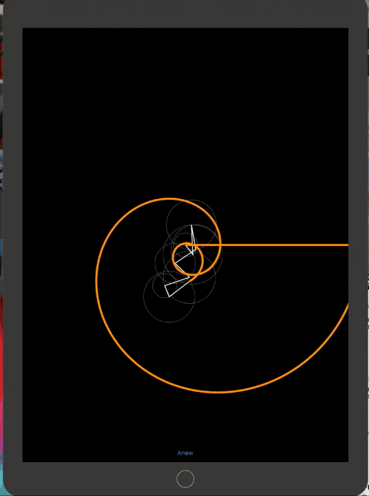

# Fourier.Forms

A simple visualization app (Android, iOS and macOS) for the Fourier series.

Destin's video inspired me: https://www.youtube.com/watch?v=ds0cmAV-Yek

## This is what you get:

You're free to do anything you want with my code :D

Enjoy!
